  

  
  &nbsp;
  
  &nbsp;
  
  &nbsp;
  

 

  I build AI-powered products end to end: the model, the backend, and the interface people actually touch. 
  Computer vision, semantic search and full-stack web, built to run in the real world, not just in a notebook.

 

<h3 align="center">Selected work</h3>

  

  
  &nbsp;
  

 

<h3 align="center">Toolbox</h3>

  

 

<h3 align="center">Telemetry</h3>

  

  
  

  

  

 

  

