<p align="center">
  
</p>

<p align="center">
  <a href="https://www.linkedin.com/in/bikki-kumar-rana-867b22380/">LinkedIn</a> &nbsp;·&nbsp;
  <a href="mailto:bikkikumarrana0@gmail.com">Email</a> &nbsp;·&nbsp;
  <a href="https://x.com/Bikkii_official">X</a> &nbsp;·&nbsp;
  <a href="https://sundarihub.in">Live work: SundariHub</a>
</p>

---

### `01` &nbsp; About

I build AI-powered products end to end: the model, the backend, and the interface people actually touch. My work sits where computer vision, semantic search, and full-stack web meet, and I care most about things that run in the real world, not just in a notebook.

I'm based in Ranchi, India, and I'm looking for SDE / Full-Stack roles.

---

### `02` &nbsp; Selected work

**01 &nbsp;[AI Smart Attendance System](https://github.com/Bikki-Rana/ai-smart-attendance-system)**
Face-recognition attendance with role-based admin and student workflows, backed by MySQL records.
`Python · OpenCV · face_recognition · MySQL`

**02 &nbsp;CampusRide**
Ride-pooling platform with trip posting, route matching, and notifications.
`Supabase · PostgreSQL`

**03 &nbsp;CodeAlpha_AI_Internship**
Two AI projects from my internship: video object tracking and a semantic-search FAQ chatbot.
`Python · OpenCV · FastAPI · sentence-transformers`

**04 &nbsp;[SundariHub](https://sundarihub.in)**
Production website designed, built, and delivered for a client.
`Next.js · React`

---

### `03` &nbsp; Toolbox

```text
languages   python   c   c++   javascript   typescript   sql
backend     django   fastapi   node.js
frontend    react   next.js   three.js
vision/ai   opencv   face_recognition   sentence-transformers   numpy   pandas
data        mysql   postgresql   supabase
tools       git   github   docker   vs code
```

---

### `04` &nbsp; Telemetry

<p align="center">
  
  &nbsp;
  
</p>

<br/>

<p align="center">
  
</p>
