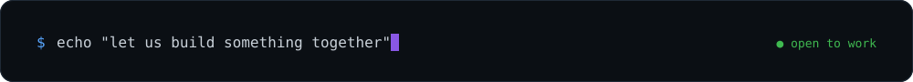

  

  <a href="https://www.linkedin.com/in/bikki-kumar-rana-867b22380/">LinkedIn</a> &nbsp;·&nbsp;
  <a href="mailto:bikkikumarrana0@gmail.com">Email</a> &nbsp;·&nbsp;
  <a href="https://x.com/Bikkii_official">X</a> &nbsp;·&nbsp;
  <a href="https://sundarihub.in">Live work: SundariHub</a>

 

  I build AI-powered products end to end: the model, the backend, and the interface people actually touch. 
  Computer vision, semantic search and full-stack web, built to run in the real world, not just in a notebook.

 

<h3 align="center">Selected work</h3>

  

  <a href="https://github.com/Bikki-Rana/ai-smart-attendance-system">AI Smart Attendance System ↗</a> &nbsp;·&nbsp;
  <a href="https://sundarihub.in">SundariHub (live) ↗</a>

 

<h3 align="center">Toolbox</h3>

  

 

<h3 align="center">Telemetry</h3>

  
  &nbsp;
  

 

  

